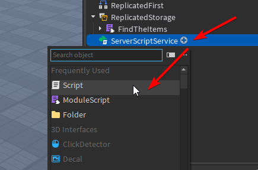

Start by importing the RBXM file into ReplicatedStorage

(1) Step 1
(2) Step 2
{ .annotate }

1. 
2. 

Then make an Items folder in ReplicatedStorage. Name this something like Items, or Creatures, or whatever you'll be collecting in your game

(1) Step 1
(2) Step 2
{ .annotate }

1. 
2. 

Them make a Script in ServerScriptService, Name this something like "FindTheItems" or Creatures, or whatever you'll be collecting in your game. Then put the following code into the script

```luau title="FindTheItems.lua" linenums="1"
local ITEMSPATH = game.ReplicatedStorage.Items -- Replace with the path for your items folder

local FindTheItemsKit = require(game.ReplicatedStorage.FindTheItems)
local FindTheItems = FindTheItemsKit.new()

FindTheItems:InitializeItemsIn(ITEMSPATH)
```

(1) Step 1
(2) Step 2
(3) Step 3
{ .annotate }

1. 
2. 
3. 

Then make a script in StarterPlayer/StarterPlayerScripts called FindTheItemsClient or Creatures, or whatever you'll be collecting in your game. Then put the following code into the script

```luau title="FindTheItemsClient.lua" linenums="1"
local FindTheItemsClient = require(game.ReplicatedStorage:WaitForChild("FindTheItems").ClientModule)

FindTheItemsClient.Init()
```

(1) Step 1
(2) Step 2
(3) Step 3
{ .annotate }

1. 
2. 
3. 